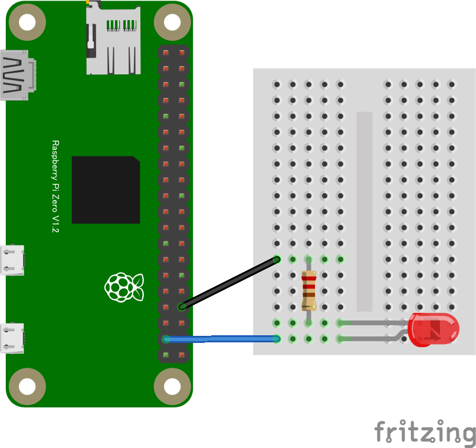
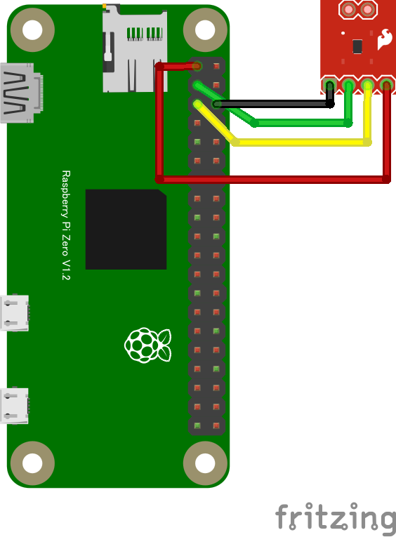

# 概要

CHIRIMEN for Raspberry Pi Zero（以降、PiZero）の Node.js から Web GPIO API と Web I2C API を扱う方法です。
[CHIRIMEN チュートリアルの中の記事](https://tutorial.chirimen.org/raspi/nodejs)を PiZero で実行した記事となります。


# 準備

PiZero 向けの CHIRMEN を導入します。このイメージを使用すると、PiZero と PC 間で USB接続※1で操作することが可能です。
PC 側に特別な設定は不要ですが、PiZero を接続する時に使用するケーブルはデータ通信が使える物を使用してください。
PiZero のUSB接続は [USBポート（電源ポートとは異なる方）](https://raspberry-pi.ksyic.com/page/page/pgp.id/19)につなげます。初回の接続時には自動的にドライバのインストールが行われます。
接続が完了したときのデバイス名※2は後の操作で指定しますので、メモなどで覚えておいてください。

公式が配布する OSイメージを使用することも可能ですが、その場合は各種設定が必要になります。
使用する OS は、Raspberry Pi OS Lite （CUI版）を推奨します。
設定方法は[別ページに記述](./pizero_otg_setting)しています。

※1　OTG Serial モードでの接続で、PiZero と PC 間は Serial 通信で接続されます。
※2　執筆環境では、Gadget Serial v2.4（COM9）という名で設定されています。


# PiZero と PC を接続する

[ブラウザの Web Serial を使用して接続が可能](https://svg2.mbsrv.net/chirimen/webSerial_piZero/testRt4.html)になります。
PiZero と PC を接続したら、Connect and Login PiZero をクリックしてください。すると別ウィンドウで接続候補がリスト表示されます。


該当する物を選んで接続をクリックするとつながります。うまく接続されると Terminal に CONNECTED と表示されます。
公式 OS イメージを使用している人は ログイン名：pi、パスワード：raspberry（デフォルト）としてください。
現時点ではオートログインは上記の設定で行われる仕様です。


無事に接続が完了したら、その後はコマンドで PiZero を操作することが可能になります。
[Web Serial RPiZero Terminal のページ](https://svg2.mbsrv.net/chirimen/webSerial_piZero/testRt4.html)には、一部の操作を簡単にする機能が備わっています。

`HOME`：ホームディレクトリに移動して中のファイル一覧を表示する
`ls -al`：現在いるディレクトリ内のファイル一覧を表示する
`wifi scan`：PiZero の周囲にある Wi-Fi 環境（SSID）の一覧を別ウィンドウに表示します　※下の画像を参照
upload:`ファイルを選択`：今いるディレクトリにファイルを送ります　※ Serial 通信は低速なので、ファイルサイズの大きいデータ送信は非推奨


# Hello Real World（Lチカを実行する）

Raspberry Pi に接続した LED を点滅させるプログラムを書きます。

準備として作業用のディレクトリを作り、そのディレクトリの中でプログラムを実行します。Terminal を使用して以下のコマンドを入力します。

```
mkdir hello-real-world
cd hello-real-world
```

※作業ディレクトリへの移動は Terminal の右に表示されるリストからの移動も出来ます。

PiZero は Raspberry Pi とピン配置が異なるので、下の図の通りに配線します。



空のテキストファイル main.js を作成し、Node.js のための JavaScript のプログラムを書きます。

```
editor main.js
```

テキストエディターで main.js を次のように書きます。

```javascript:main.js
const { requestGPIOAccess } = require("node-web-gpio");
const sleep = require("util").promisify(setTimeout);

async function blink() {
  const gpioAccess = await requestGPIOAccess();
  const port = gpioAccess.ports.get(26);

  await port.export("out");

  for (;;) {
    await port.write(1);
    await sleep(1000);
    await port.write(0);
    await sleep(1000);
  }
}

blink();
```
書き終えたら保存します。

Node.js で main.js を実行するには、次のコマンドを実行します。

```
node main.js
```

LED が点滅すれば完成です 🎉


# いろいろなデバイスを試す

CHIRIMEN ブラウザーから利用できるいろいろなデバイスはすべて同じように Node.js から扱うことができます。例として i2c 接続の温度センサーを試します。

次のコードは温度センサー ADT7410 を利用して温度を表示するプログラムです。
空のテキストファイル `temp.js` を作成し、Node.js のための JavaScript のプログラムを書きます。

```
editor temp.js
```

テキストエディターで temp.js を次のように書きます。

```javascript
const { requestI2CAccess } = require("node-web-i2c");
const ADT7410 = require("@chirimen/adt7410");

async function measure() {
  const i2cAccess = await requestI2CAccess();
  const i2c1 = i2cAccess.ports.get(1);
  const adt7410 = new ADT7410(i2c1, 0x48);
  await adt7410.init();
  const temperature = await adt7410.read();
  console.log(`Temperature: ${temperature} ℃`);
}

measure();
```

接続は下の図のようになります。



温度センサーが正しく接続されているかを確認します。Terminal より以下のコマンドを入力します。

```
i2cdetect -y -r 1
```

正しく接続できていれば下記のように表示されます。

```
$ i2cdetect -y -r 1
     0  1  2  3  4  5  6  7  8  9  a  b  c  d  e  f
00:          -- -- -- -- -- -- -- -- -- -- -- -- --
10: -- -- -- -- -- -- -- -- -- -- -- -- -- -- -- --
20: -- -- -- -- -- -- -- -- -- -- -- -- -- -- -- --
30: -- -- -- -- -- -- -- -- -- -- -- -- -- -- -- --
40: -- -- -- -- -- -- -- -- 48 -- -- -- -- -- -- --
50: -- -- -- -- -- -- -- -- -- -- -- -- -- -- -- --
60: -- -- -- -- -- -- -- -- -- -- -- -- -- -- -- --
70: -- -- -- -- -- -- -- --
```

`48`という表示が見えます。これは 16 進数表示であり、 `0x48` は ADT7410 の SlaveAddress です。

Node.js で temp.js を実行するには、次のコマンドを実行します。

```
node temp.js
```

温度が表示されれば完成です 🎉


デバイスを扱うためのパッケージについてさらに知りたい場合は [サンプル一覧](./CHIRIMEN-Nodejs-examples) を参照してください。
※ドライバは随時追加されていきます。[CHIRIMEN Drivers](https://github.com/chirimen-oh/chirimen-drivers) に最新情報が掲載されますので、併せて確認してみてください。

また、CHIRIMEN チュートリアルのなかには、Web GPIO や Web I2C によって扱うことのできる[外部デバイスとサンプルコードの一覧があります](https://tutorial.chirimen.org/raspi/partslist)。こちらも参考になるかもしれません。


# CHIRIMEN ブラウザー版との差異

| CHIRIMEN ブラウザー版       | Node.js                                                      |
| --------------------------- | ------------------------------------------------------------ |
| navigator.requestGPIOAccess | const { requestGPIOAccess } = require("node-web-gpio"); requestGPIOAccess |
| navigator.requestI2CAccess  | const { requestI2CAccess } = require("node-web-i2c"); requestI2CAccess |
| sleep                       | const sleep = require("util").promisify(setTimeout); sleep   |


以上となります。


※ 使っていて気になった点

Web Serial RPiZero Terminal について

- Terminal画面は上寄せが良い（大量のファイルリストを作るとセンター移動は使いにくい）
- シャットダウンボタンがあると便利（電プチを防ぐ意味でも必要？）
