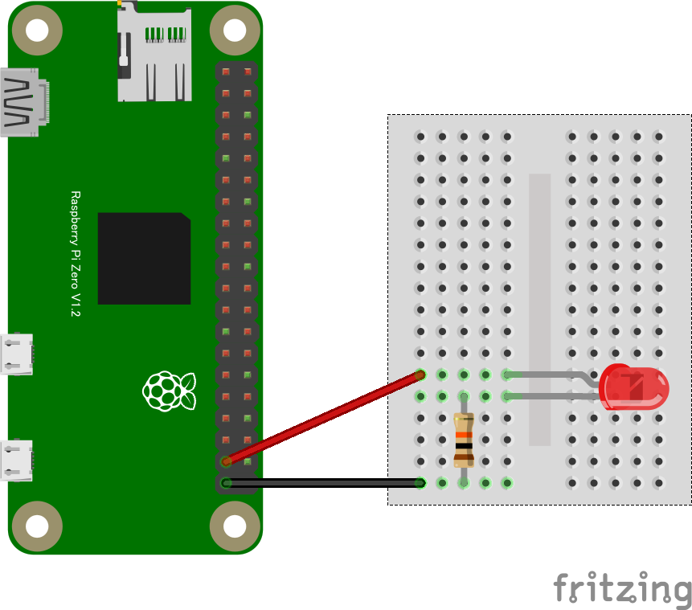

# 概要

Raspberry Pi Zero（以降、PiZero）の Node.js から Web GPIO API と Web I2C API を扱う方法です。
[CHIRIMEN チュートリアルの中の記事](https://tutorial.chirimen.org/raspi/nodejs)を PiZero で実行した記事となります。


# 準備

PiZero の環境を、本体にディスプレイやキーボード接続をしないで設定していきます。
OS は、Raspberry Pi OS Lite （CUI版）を使用します。
OS の導入には、公式TOOL の [Raspberry Pi Imager](https://www.raspberrypi.org/software/) を使用します。

Image の書き込みが完了すると、自動的にアンマウントされるので、再度 microSD を挿入し直します。
boot フォルダ内にファイル名 `ssh` という空ファイルと、無線設定を記述した `wpa_supplicant.conf` をコピーします。

`wpa_supplicant.conf` は以下の内容で記述します。
※ [] 内は自身の環境に合わせて記述を変更してください。

```
ctrl_interface=DIR=/var/run/wpa_supplicant GROUP=netdev
update_config=1
country=JP
network={
   ssid=" [ルータの名前] "
   psk=" [パスワード] "
}
```

Wi-Fi設定を[ブラウザから設定するツール](https://qiita.com/mascii/items/a43d71572e1919e56398) も公開されています。

このファイルを boot に入れておくと、起動時に自動的に ssh と 無線LAN を有効化します。
これ以降の操作は ssh を使い遠隔で進めていきます。

無線LAN に簡単に接続が出来ない環境では、[PiZero を USB OTG 接続](https://github.com/webdino/pizero-workshop/blob/20190528/docs/Setup.md) で設定することが出来ます。


# PiZero に Node.js をインストールする

PiZero に積まれている ARMv6 は古いチップになります。これに対応する Node.js は v10（v11）までが公式の提供バージョンとなります。また [NodeSource を使ったインストール方法](https://github.com/nodesource/distributions#installation-instructions) には対応していません。
導入するには手動でインストールをする必要があります。

公式の提供する Node.js v10 は[サポート期限が 2021年4月30日](https://nodejs.org/ja/about/releases/) までとなっていますので、今回は非公式版の Node.js v14 Armv6対応版 を使用します。
非公式版の情報は こちら（ [unofficial Node.js](https://unofficial-builds.nodejs.org/download/release/) ）を参照してください。

リリース情報（[公式](https://nodejs.org/ja/download/)、[非公式](https://unofficial-builds.nodejs.org/download/release/) ）より、バージョン確認をします。
ターミナルを起動して以下のコマンドを実行します。
※2021年4月20日の状況で書いております。

```
VERSION=v14.16.1
DISTRO=linux-armv6l
wget https://unofficial-builds.nodejs.org/download/release/$VERSION/node-$VERSION-$DISTRO.tar.xz
```

ダウンロードが終わったら解凍して導入していきます。

```
sudo mkdir -p /usr/local/lib/nodejs
sudo tar -xJvf node-$VERSION-$DISTRO.tar.xz -C /usr/local/lib/nodejs
```

~/.profile に追記を行います。

```
# Nodejs
VERSION=v14.16.1
DISTRO=linux-armv6l
export PATH=/usr/local/lib/nodejs/node-$VERSION-$DISTRO/bin:$PATH
```

.profileの再読み込み

```
. ~/.profile
```

以上で導入は完了です。
バージョンをチェックして確認をしてください。

```
$ node -v
v14.16.1
$ npm -v
6.14.12
$ npx -v
6.14.12
```

参照: [Installation · nodejs/help Wiki · GitHub](https://github.com/nodejs/help/wiki/Installation)


# Web GPIO API と Web I2C API を PiZero に導入する

[CHIRIMEN チュートリアル の 新しいディレクトリの作成](https://tutorial.chirimen.org/raspi/nodejs) 以下の内容を実施しています。
以降は大きな変更点は無く実行することが出来ました。

プログラムを実行するための環境を整えます。
作業用のディレクトリを作り、そのディレクトリの中でプログラムを実行します。

ssh を使用して以下のコマンドを入力します。

```
mkdir hello-real-world
cd hello-real-world
```

npm のためのファイル package.json を作成します。

```
npm init -y
```

作業用のディレクトリの中に npm パッケージ [node-web-gpio](https://www.npmjs.com/package/node-web-gpio) と [node-web-i2c](https://www.npmjs.com/package/node-web-i2c) をインストールします。

```
npm install node-web-gpio node-web-i2c
```

これで Node.js から WebGPIO API と WebI2C API を使う準備は完了です。


# Hello Real World（Lチカを実行する）

Raspberry Pi に接続した LED を点滅させるプログラムを書きます。
PiZero は Raspberry Pi とピン配置が異なるので、下の図の通りに配線します。



空のテキストファイル main.js を作成し、Node.js のための JavaScript のプログラムを書きます。

```
editor main.js
```

テキストエディターで main.js を次のように書きます。

```javascript:main.js
const { requestGPIOAccess } = require("node-web-gpio");
const sleep = require("util").promisify(setTimeout);

async function blink() {
  const gpioAccess = await requestGPIOAccess();
  const port = gpioAccess.ports.get(26);

  await port.export("out");

  for (;;) {
    await port.write(1);
    await sleep(1000);
    await port.write(0);
    await sleep(1000);
  }
}

blink();
```
書き終えたら保存します。

Node.js で main.js を実行するには、次のコマンドを実行します。

```
node main.js
```

LED が点滅すれば完成です 🎉


# いろいろなデバイスを試す

CHIRIMEN ブラウザーから利用できるいろいろなデバイスはすべて同じように Node.js から扱うことができます。
CUI版 の OS には i2c 関係のパッケージが入っていないので導入します。また、デフォルトで i2c が無効になっているので、raspi-config で有効化しておきます。

```
sudo apt-get install -y i2c-tools
sudo raspi-config
```

次のコードは温度センサー ADT7410 を利用して温度を表示するプログラムです。

```javascript
const { requestI2CAccess } = require("node-web-i2c");
const ADT7410 = require("@chirimen/adt7410");

async function measure() {
  const i2cAccess = await requestI2CAccess();
  const i2c1 = i2cAccess.ports.get(1);
  const adt7410 = new ADT7410(i2c1, 0x48);
  await adt7410.init();
  const temperature = await adt7410.read();
  console.log(`Temperature: ${temperature} ℃`);
}

measure();
```

コマンド `npm i @chirimen/adt7410` を実行すると、温度センサー ADT7410 を利用するための `@chirimen/adt7410` パッケージをインストールできます。

接続は下の図のようになります。


デバイスを扱うためのパッケージについてさらに知りたい場合は [サンプル一覧](./CHIRIMEN-Nodejs-examples) を参照してください。
※ドライバは随時追加されていきます。[CHIRIMEN Drivers](https://github.com/chirimen-oh/chirimen-drivers) に最新情報が掲載されますので、併せて確認してみてください。

また、CHIRIMEN チュートリアルのなかには、Web GPIO や Web I2C によって扱うことのできる[外部デバイスとサンプルコードの一覧があります](https://tutorial.chirimen.org/raspi/partslist)。こちらも参考になるかもしれません。


# CHIRIMEN ブラウザー版との差異

| CHIRIMEN ブラウザー版       | Node.js                                                      |
| --------------------------- | ------------------------------------------------------------ |
| navigator.requestGPIOAccess | const { requestGPIOAccess } = require("node-web-gpio"); requestGPIOAccess |
| navigator.requestI2CAccess  | const { requestI2CAccess } = require("node-web-i2c"); requestI2CAccess |
| sleep                       | const sleep = require("util").promisify(setTimeout); sleep   |


以上となります。

